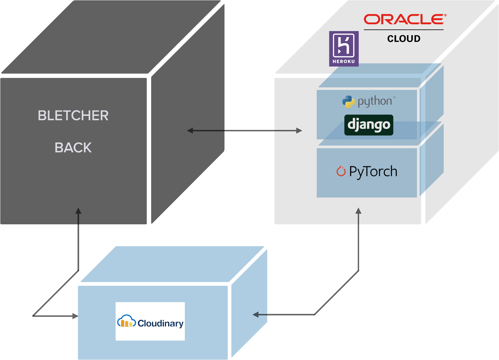

_🚀 Version 1.1.0 Released_

# Bletcher-Mix


[Bletcher Project](https://github.com/Bletcher-Project/Bletcher)의 __AI Repository__ 입니다. 인공지능 예술 웹 서비스 __Bletcher의 AI서버입니다.__


## What we did...✍️

👏👏우리는 107개의 commit과 8개의 branch 8개의 issue 가 있었어요!👏👏


## Technology



- Pytorch
- Django
- Cloudinary 
- Heroku
- Oracle Cloud

## 프로젝트 배포

- Cloudinary를 통한 Storage Upload
- Heroku를 통한 어플리케이션 배포 
  - [▶︎ Pull Request](https://github.com/Bletcher-Project/bletcher_mix/pull/5)
- Oracle Cloud를 통한 어플리케이션 배포 
  - [▶︎ Issue](https://github.com/Bletcher-Project/bletcher_mix/issues/7)
  - [▶︎ Issue](https://github.com/Bletcher-Project/bletcher_mix/issues/8)
  - [▶︎ Pull Request](https://github.com/Bletcher-Project/bletcher_mix/pull/10)

## 핵심기능

- 두 이미지 합성 구현
  - pytorch 기반 neural-style기술을 활용한 이미지 합성
- 웹서버 구현
  - django를 이용하여 `/synthesizing`라우터를 통해 이미지 합성 및 이미지 백 클라우디너리에 결과 반환
- 클라우드 배포
  - Heroku와 Oracle Cloud를 활용하여 항상 작동하는 서버 배포

## 트러블 슈팅

- Heroku timeout issue
  - [▶︎ Issue](https://github.com/Bletcher-Project/bletcher_mix/issues/6)

## Getting Started

Bletcher-mix는 Oracle Cloud에 배포되어있어 따로 환경을 구축할 필요가 없지만, <u>개발자 환경에서 커스터마이징 하고싶은 분은 아래의 절차를 따라주세요.</u>

### Prerequisites

실행전 [requirements](./requirements.txt)을 참고하여 Python 개발 환경을 구축하십시오
</br>

### Installation

1. `git clone https://github.com/Bletcher-Project/bletcher_mix`
2. `./bletcher_mix/` 경로의 [.env.example](./bletcher_mix/.env.example)를 참고하여 `.env` 파일을 생성합니다.

끝입니다. 쉽죠? 🥳
</br>

## Run

Oracle Cloud 에 배포되어 있습니다. `http://193.123.235.185:8000`의 `/synthesizing`라우터로 요청합니다.
</br>

## Run Locally 
이는 [bletcher-back](https://github.com/Bletcher-Project/bletcher-back), Heroku, Cloudinary 등의 서비스와 연결이 필수적이고 해당 서비스들에게 최적화되어 있습니다. 실행하려면 최소한 bletcher-back server의 실행과 Cloudinary 연동이 필요합니다.

1. 터미널에서 `python manage.py runserver`를 실행합니다.
2. [**bletcher-back**](https://github.com/Bletcher-Project/bletcher-back) repository를 clone하고 해당 python 서버에 `/synthesizing` 라우터로 요청합니다.
</br>

VGG19 모델을 통해 실행 결과를 보고 싶다면 [neural_style.py](./api/neural_style.py) 파일을 열어 layer와 model을 다음과 같이 수정해야 합니다.

```python
# VGG19 ver. Layer (line 83-89)
content_layers_default = ['conv_3']
style_layers_default = ['conv_1', 'conv_2', 'conv_3', 'conv_4', 'conv_5']

# VGG19 ver. Model (line 214-218)
cnn = models.vgg19(pretrained=True).features.to(device).eval()
```

Resnet50 모델을 통해 실행 결과를 보고 싶다면 [neural_style.py](./api/neural_style.py) 파일을 열어 layer와 model을 다음과 같이 수정해야 합니다.

```python
# resnet50 ver. Layer (line 83-89)
content_layers_default = ['conv_1']
style_layers_default = ['conv_1', 'conv_2', 'conv_3', 'conv_4', 'conv_5']

# resnet50 ver. Model (line 214-218)
cnn = models.resnet50(pretrained=True).to(device).eval()
```
❗️❗️neural style은 pytorch기반 CNN 모델로 **VGG19** 모델을 사용했을 때 최적의 성능을 볼 수 있습니다.❗️❗️
</br>

## License

All of source codes under our project are using [MIT License](http://opensource.org/licenses/MIT).
</br>

## Reference

- [A Neural Algorithm of Artistic Style - Leon A. Gatys, Alexander S. Ecker, Matthias Bethge](https://arxiv.org/abs/1508.06576)
- [alexis-jacq/Pytorch-Tutorials](https://github.com/alexis-jacq/Pytorch-Tutorials)
- [NEURAL TRANSFER USING PYTORCH by Alexis Jacq - Winston Herring](https://pytorch.org/tutorials/advanced/neural_style_tutorial.html)

## Contact

- Name : Yoon GaYoung 
- Email : rkdud0925@hanyang.ac.kr
- Instagram : @yoongoing 

Project Link: [https://github.com/Bletcher-Project](https://github.com/Bletcher-Project)
