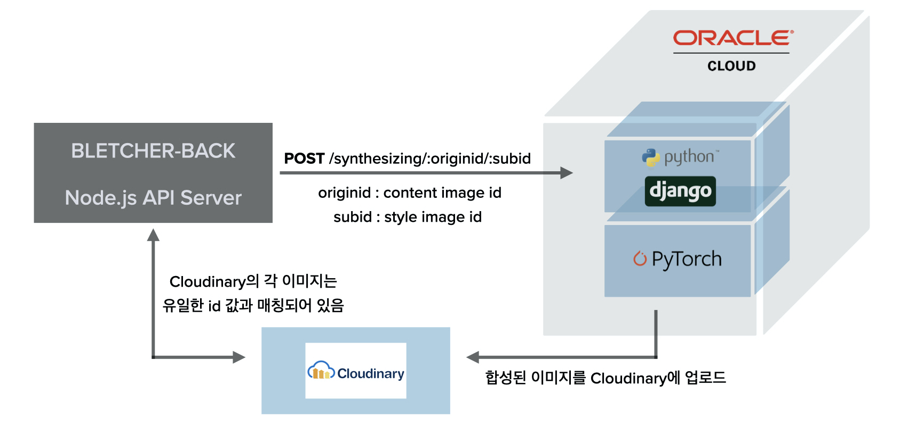

  [](https://github.com/Bletcher-Project/bletcher_mix/issues) [](https://github.com/Bletcher-Project/bletcher_mix/blob/main/LICENSE)

# Bletcher-Mix 👩🏻‍🎨


인공지능 예술 웹 서비스 [Bletcher Project](https://github.com/Bletcher-Project/Bletcher)의 **AI Repository** 입니다. Django로 이미지 합성 서버를 구현하였으며 Oracle Cloud에 배포되어 있습니다.

_👏 우리는 [bletcher-ml](https://github.com/Bletcher-Project/bletcher-ml) 저장소를 지나와 100여개의 commit과 8개의 issue를 통한 많은 토의 끝에 배포되었습니다!!_

_🚀 Version 1.1.0 Released_

---

## Technology

- Pytorch
- Django
- Cloudinary
- Heroku
- Oracle Cloud



## 핵심기능

- PyTorch 기반 Neural-Style-Transfer 기술을 활용한 이미지 합성 기능 구현
- 이미지 합성 결과를 반환하는 Django 서버 사이드 어플리케이션 구현

## 프로젝트 배포

- [Heroku를 통한 어플리케이션 배포](https://github.com/Bletcher-Project/bletcher_mix/pull/5)
- [Oracle Cloud를 통한 어플리케이션 배포](https://github.com/Bletcher-Project/bletcher_mix/pull/10)
  - Heroku H12 Request timeout 문제 [▶︎ Issue](https://github.com/Bletcher-Project/bletcher_mix/issues/6)
  - Heroku를 대체할 클라우드 서비스 비교 보고서 [▶︎ Issue](https://github.com/Bletcher-Project/bletcher_mix/issues/7)
  - ORACLE CLOUD SSH 접속하기 [▶︎ Issue](https://github.com/Bletcher-Project/bletcher_mix/issues/8)

---

## Run

이미지 합성 서버는 Django 어플리케이션으로 Oracle Cloud에 배포되어 있습니다. `http://193.123.235.185:8000`의 `/synthesizing/:originid/:subid` 라우터로 POST 요청합니다.

## Getting Started

Bletcher-mix는 Oracle Cloud에 배포되어있어 따로 환경을 구축할 필요가 없지만, 개발자 환경에서 커스터마이징 하고싶은 분은 아래의 절차를 따라주세요.

### Prerequisites

실행 전 [requirements](./requirements.txt)를 참고하여 Python 개발 환경을 구축하십시오. 가상 환경을 만들어 구축할 것을 권장합니다.

### Installation

1. `git clone https://github.com/Bletcher-Project/bletcher_mix`
2. `./bletcher_mix/` 경로의 [.env.example](./bletcher_mix/.env.example)를 참고하여 `.env` 파일을 생성합니다.

### Run Locally

이는 [bletcher-back](https://github.com/Bletcher-Project/bletcher-back), Heroku, Cloudinary 등의 서비스와 연결이 필수적이고 해당 서비스들에게 최적화되어 있습니다. 실행하려면 최소한 bletcher-back server의 실행과 Cloudinary 연동이 필요합니다.

1. 터미널에서 `python manage.py runserver`를 실행합니다.
2. [**bletcher-back**](https://github.com/Bletcher-Project/bletcher-back) repository를 clone하고 해당 python 서버에 `/synthesizing` 라우터로 요청합니다.

### 모델별 실행 결과 확인

> ❗️ neural style은 pytorch기반 CNN 모델로 **VGG19** 모델을 사용했을 때 최적의 성능을 볼 수 있습니다.

VGG19 모델을 통해 실행 결과를 보고 싶다면 [neural_style.py](./api/neural_style.py) 파일을 열어 layer와 model을 다음과 같이 수정해야 합니다.

```python
# VGG19 ver. Layer (line 83-89)
content_layers_default = ['conv_3']
style_layers_default = ['conv_1', 'conv_2', 'conv_3', 'conv_4', 'conv_5']

# VGG19 ver. Model (line 214-218)
cnn = models.vgg19(pretrained=True).features.to(device).eval()
```

Resnet50 모델을 통해 실행 결과를 보고 싶다면 [neural_style.py](./api/neural_style.py) 파일을 열어 layer와 model을 다음과 같이 수정해야 합니다.

```python
# resnet50 ver. Layer (line 83-89)
content_layers_default = ['conv_1']
style_layers_default = ['conv_1', 'conv_2', 'conv_3', 'conv_4', 'conv_5']

# resnet50 ver. Model (line 214-218)
cnn = models.resnet50(pretrained=True).to(device).eval()
```

---

## Reference

- [A Neural Algorithm of Artistic Style - Leon A. Gatys, Alexander S. Ecker, Matthias Bethge](https://arxiv.org/abs/1508.06576)
- [alexis-jacq/Pytorch-Tutorials](https://github.com/alexis-jacq/Pytorch-Tutorials)
- [NEURAL TRANSFER USING PYTORCH by Alexis Jacq - Winston Herring](https://pytorch.org/tutorials/advanced/neural_style_tutorial.html)

## License

All of source codes under our project are using [MIT License](http://opensource.org/licenses/MIT).

---

## Bletcher Team

- 권혁진 - [@KimKwon](https://github.com/KimKwon) - khj9709@icloud.com
- 김동규 - [@kimdg1105](https://github.com/kimdg1105) - kimss7334@naver.com
- 서그림 - [@Seogeurim](https://github.com/Seogeurim) - geulims@naver.com
- 윤가영 - [@yoongoing](https://github.com/yoongoing) - rkdud0925@hanyang.ac.kr
