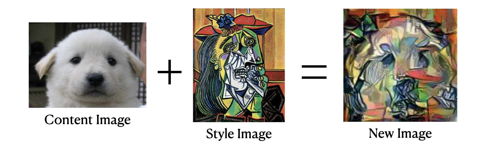

# Bletcher - Mix (Neural Style Transfer)



Neural Style Transfer 알고리즘을 이용한 이미지 합성을 요청할 수 있는 Python Django Server 입니다.

_🚀 Version 1.1.0 Released_

## Technology

- PyTorch
- Django
- Heroku

## environment

> [requirements](./requirements.txt) 참고

- python 3.8.5
- torch(cpu-only) 1.5.0
- torchvision(cpu-only) 0.6.0
- django 3.1.3

## Run version 1.0

Heroku Cloud PaaS를 사용해 배포되어 있습니다. [https://bletcher-mix.herokuapp.com/](https://bletcher-mix.herokuapp.com/)의 `/synthesizing` 라우터로 요청합니다.

> version 1.0 : Heroku 서버의 무료 사용 용량 제한으로 **Resnet50** 모델로 임시 배포되어 있습니다.

## Run version 1.1

Oracle Cloud 에 배포되어 있습니다. `http://193.123.235.185:8000`의 `/synthesizing`라우터로 요청합니다.

> version 1.1 : Oracle Cloud 에 배포되어있고, **VGG19** 모델로 배포되어있습니다.

## Run Locally (Development Mode)

이는 [bletcher-back](https://github.com/Bletcher-Project/bletcher-back), Heroku, Cloudinary 등의 서비스와 연결이 필수적이고 해당 서비스들에게 최적화되어 있습니다. 실행하려면 최소한 bletcher-back server의 실행과 Cloudinary 연동이 필요합니다.

1. `./bletcher_mix/` 경로의 [.env.example](./bletcher_mix/.env.example)를 참고하여 `.env` 파일을 생성합니다.
2. 터미널에서 `python manage.py runserver`를 실행합니다.
3. [**bletcher-back**](https://github.com/Bletcher-Project/bletcher-back) repository를 clone하고 해당 python 서버에 `/synthesizing` 라우터로 요청합니다.

> neural style은 pytorch기반 CNN 모델로 **VGG19** 모델을 사용했을 때 최적의 성능을 볼 수 있습니다.


#### VGG19 모델을 통해 실행 결과를 보고 싶다면 [neural_style.py](./api/neural_style.py) 파일을 열어 layer와 model을 다음과 같이 수정해야 합니다.
```python
# VGG19 ver. Layer (line 83-89)
content_layers_default = ['conv_3']
style_layers_default = ['conv_1', 'conv_2', 'conv_3', 'conv_4', 'conv_5']

# VGG19 ver. Model (line 214-218)
cnn = models.vgg19(pretrained=True).features.to(device).eval()
```


#### Resnet50 모델을 통해 실행 결과를 보고 싶다면 [neural_style.py](./api/neural_style.py) 파일을 열어 layer와 model을 다음과 같이 수정해야 합니다.

```python
# resnet50 ver. Layer (line 83-89)
content_layers_default = ['conv_1']
style_layers_default = ['conv_1', 'conv_2', 'conv_3', 'conv_4', 'conv_5']

# resnet50 ver. Model (line 214-218)
cnn = models.resnet50(pretrained=True).to(device).eval()
```

## Reference

- [A Neural Algorithm of Artistic Style - Leon A. Gatys, Alexander S. Ecker, Matthias Bethge](https://arxiv.org/abs/1508.06576)
- [alexis-jacq/Pytorch-Tutorials](https://github.com/alexis-jacq/Pytorch-Tutorials)
- [NEURAL TRANSFER USING PYTORCH by Alexis Jacq - Winston Herring](https://pytorch.org/tutorials/advanced/neural_style_tutorial.html)
